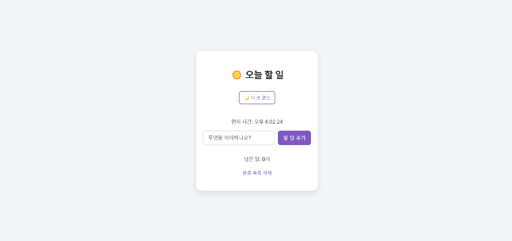

# 📝 To-Do List App

**🚀 배포 링크**: [To-Do List 바로가기](https://charming-mooncake-7a75df.netlify.app/)

React를 이용한 To-Do List 애플리케이션입니다. 할 일을 추가하고, 완료 상태를 체크하며, 할 일을 편집하거나 삭제할 수 있는 기능을 제공합니다.

 
  
 

## 사용 기술

- React
- React Hooks (useState, useEffect)
- uuid (고유한 ID 생성)
- 로컬 스토리지 (데이터 저장)

## 주요 기능

- 할 일 추가: 입력창에 내용을 작성하고 'Enter' 또는 '추가' 버튼을 클릭하여 할 일을 추가할 수 있습니다.
- 완료 상태 토글: 할 일을 완료 상태로 변경하고 스타일을 다르게 표시합니다.
- 할 일 삭제: 각 할 일 항목을 개별적으로 삭제할 수 있습니다.
- 할 일 편집: 더블 클릭하여 할 일을 수정할 수 있습니다.
- 완료된 할 일 삭제: 완료된 할 일을 한 번에 삭제할 수 있습니다.
- 다크 모드: 밝은 모드와 다크 모드 전환 기능을 제공합니다.
- 실시간 시간 표시: 현재 시간이 1초마다 업데이트 되어 표시됩니다.
- 로컬 스토리지 저장: 앱을 종료하고 다시 실행해도 할 일 목록이 유지됩니다.
